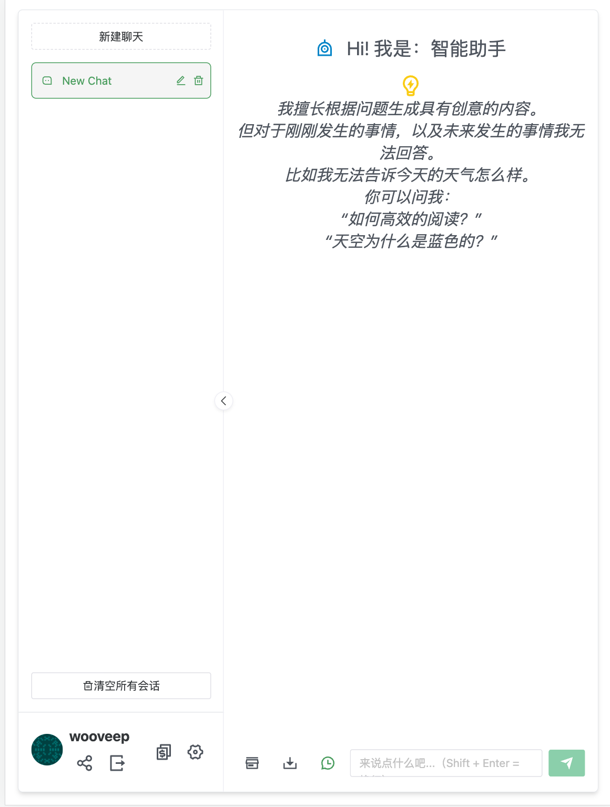
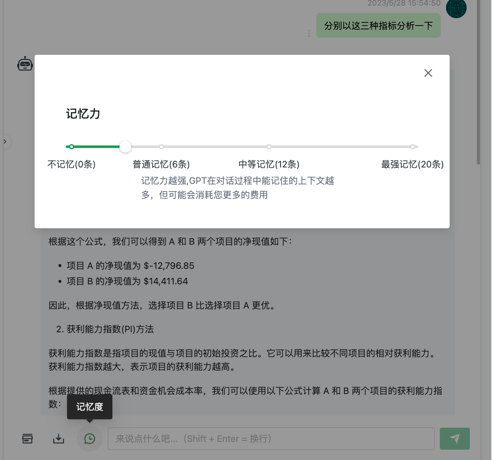
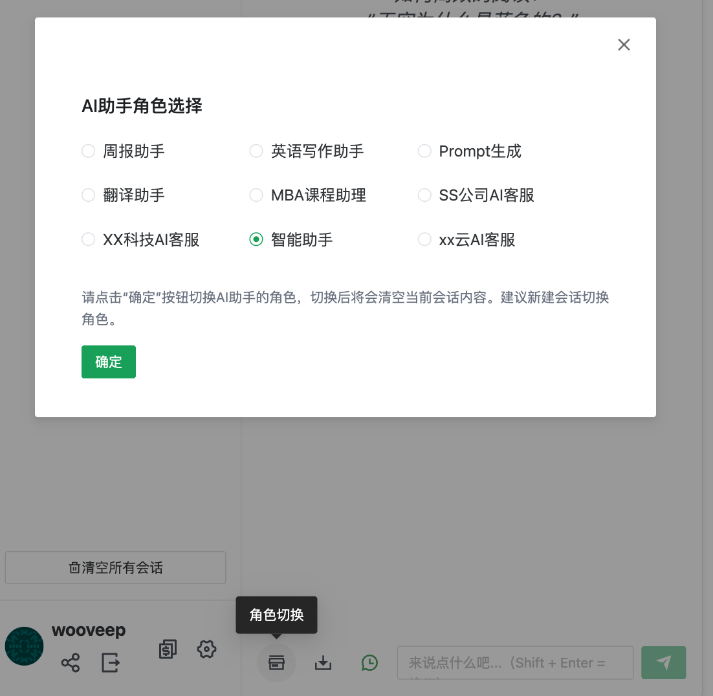
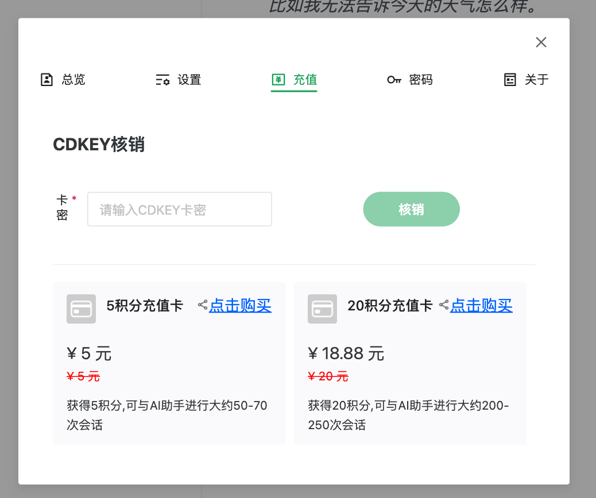
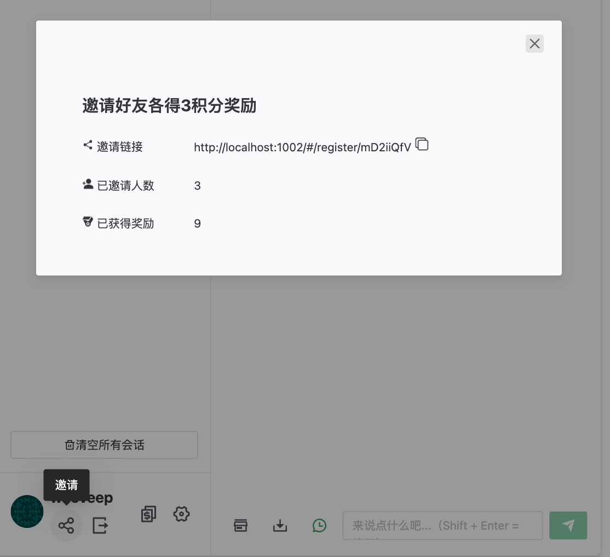
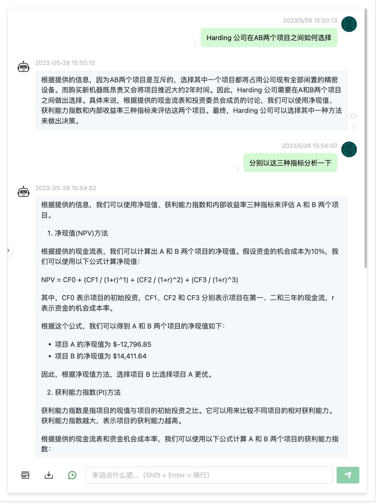

<!--
 * @Author: cloudyi.li
 * @Date: 2023-03-23 13:04:10
 * @LastEditTime: 2023-06-27 15:13:52
 * @LastEditors: cloudyi.li
 * @FilePath: /chatserver-web/README.md
-->

# 基于OPENAI的ChatGPT API开发的AI助手服务

## 更新

  智能搜搜-支持OPENAI 函数调用、与16K模型，使用azureAPI时会使用自己实现的函数调用方式处理。

## 体验站

  [https://chat.wooveep.net](https://chat.wooveep.net/#/register/uNJtISQw)

>本项目前端Fork自项目[Chanzhaoyu](https://github.com/Chanzhaoyu)/**[chatgpt-web](https://github.com/Chanzhaoyu/chatgpt-web)**

本仓库为前端代码，依赖的后端仓库为[wooveep](https://github.com/wooveep)/[chatserver-api](https://github.com/wooveep/chatserver-api)使用Golang语言编写

- [基于OPENAI的ChatGPT API开发的AI助手服务](#基于openai的chatgpt-api开发的ai助手服务)
  - [更新](#更新)
  - [体验站](#体验站)
  - [实现功能](#实现功能)
  - [应用场景](#应用场景)
  - [目标群体](#目标群体)
  - [系统演示](#系统演示)
    - [项目截图](#项目截图)
      - [用户登录](#用户登录)
      - [用户注册](#用户注册)
      - [主页面](#主页面)
      - [会话上下文设置](#会话上下文设置)
      - [会话角色控制](#会话角色控制)
      - [用户充值与邀请](#用户充值与邀请)
      - [基于本地知识库的问答](#基于本地知识库的问答)
  - [待实现列表](#待实现列表)
  - [安装部署](#安装部署)
    - [前置条件](#前置条件)
      - [启动后端API进程](#启动后端api进程)
    - [前端项目启动](#前端项目启动)
      - [编译部署](#编译部署)
        - [前置要求](#前置要求)
        - [克隆项目并安装依赖](#克隆项目并安装依赖)
        - [运行网页](#运行网页)
        - [打包dist](#打包dist)
        - [打包docker](#打包docker)
      - [docker方式启动](#docker方式启动)
  - [License](#license)

## 实现功能

- [x] 支持Azure API，OpenAI API
- [x] 用户登录、注册、密码修改、密码重置、角色管理
- [x] 用户积分额度、会员权益管理
- [x] 后端云存储用户会话和聊天记录
- [x] 按照会话指定AI角色，并随意切换
- [x] 长回复功能，后端自动处理token截断回答
- [x] 支持结合本地知识库问答
- [x] 后端处理会话上下文逻辑
- [x] 支持流式回复打字机效果
- [x] 支持按照Token计费
- [x] 基于卡密方式的用户额度充值
- [x] 用户消费明细查询
- [x] 用户邀请控制
- [x] 联网的GPT

## 应用场景

我们 的AI助手适用于以下场景：

- 企业用户：结合公开外发客户的产品手册，解答产品问题，优化客服成本。
- 保险行业：结合保险条款内容，解答客户关于保险相关信息，推荐客户更合适保险产品。
- 教育行业：结合常见题库、文本，作为私人家教。

## 目标群体

- 个人部署
- 商业部署
- 企业部署
- 团队部署

## 系统演示


### 项目截图

#### 用户登录


#### 用户注册


#### 主页面



#### 会话上下文设置



#### 会话角色控制



#### 用户充值与邀请





#### 基于本地知识库的问答




## 待实现列表

- [ ] 系统后台日志管理
- [ ] 系统后台管理界面
- [ ] 用户系统设置模块
- [ ] 自定义敏感词
- [ ] 联网插件功能
- [ ] 自定义AI角色页面
- [ ] 文档上传问答
- [ ] 语音问答

## 安装部署

### 前置条件

#### 启动后端API进程

参考后端项目安装部署 [安装部署](https://github.com/wooveep/chatserver-api#%E5%AE%89%E8%A3%85%E9%83%A8%E7%BD%B2)

### 前端项目启动

#### 编译部署

##### 前置要求

 Node

`node` 需要 `^16 || ^18 || ^19` 版本（`node >= 14` 需要安装 [fetch polyfill](https://github.com/developit/unfetch#usage-as-a-polyfill)），使用 [nvm](https://github.com/nvm-sh/nvm) 可管理本地多个 `node` 版本

```shell
node -v
```

PNPM
如果你没有安装过 `pnpm`

```shell
npm install pnpm -g
```

##### 克隆项目并安装依赖

```shell
git clone  https://github.com/wooveep/chatserver-web.git
cd chatserver-web
pnpm install
```

##### 运行网页

根目录下运行以下命令

```shell
pnpm dev
```

##### 打包dist

```shell
vite build 
```

##### 打包docker

```shell
docker build -t chatserver-web . 
```

#### docker方式启动

获取docker镜像

```shell
 docker pull  wooveep/chatserver-web:latest 
```

启动项目：

```shell
docker  run   -p 18088:80 -e "WEB_URL=域名" -e "Back_IP=后端APIIP地址"      wooveep/chatserver-web:latest
```

## License

MIT © [Cloudyi Li](https://github.com/wooveep/chatserver-api/blob/main/LICENSE)
